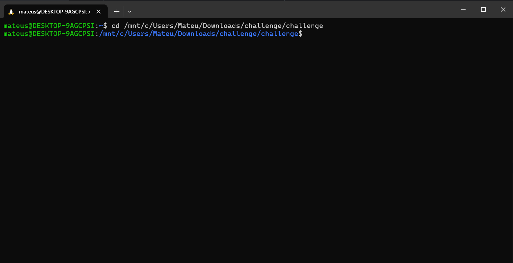
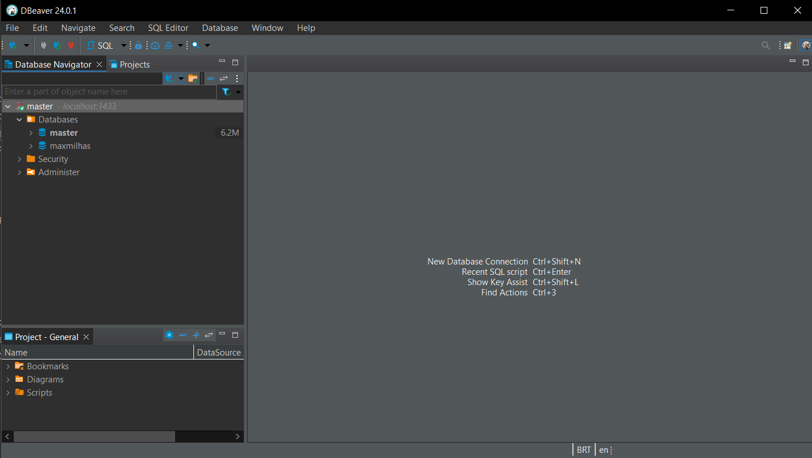
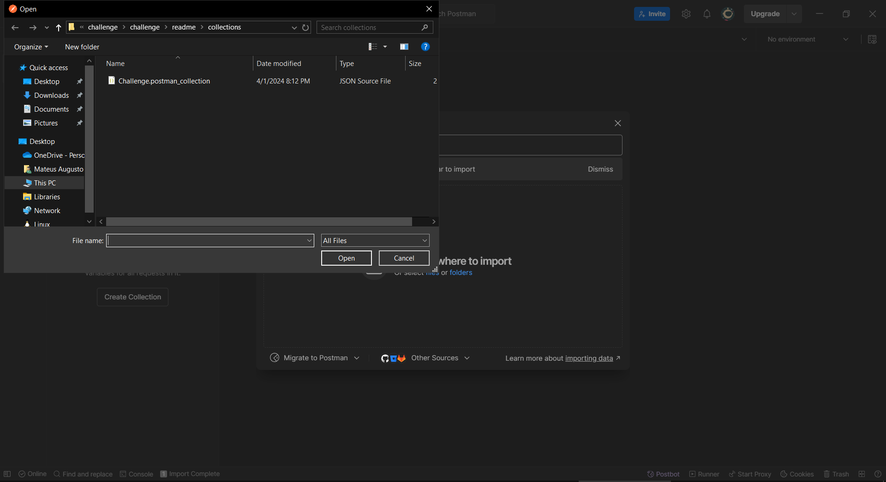

<h1 align="center">Desafio Técnico Backend</h1>

  

Linguagem: `Java`

Framework: `Spring Boot`

<h1 align="center">Descrição</h1>

Atualmente o time de análise antifraude do ecommerce realiza um controle de CPFs em uma planilha eletrônica. Nesta planilha são adicionados CPFs com risco de
fraude. 

Com o aumento da nossa base de clientes têm ficado cada vez mais difícil manter o controle manual, tendo em vista isso o Product Owner do time levantou a ideia desse projeto para ter um controle melhor da base e dados.

<h1 align="center">Pré-requisitos</h1>

Antes de iniciar, se assegure que possui os requisitos abaixo:

- Docker
- Java 17
- Dbeaver (Opcional)
- Intellij (Opcional)
- Postman (Opcional)
- Insomnia (Opcional)

<h1 align="center">Instalação/Execução</h1>

Para instalar/executar este projeto, siga as seguintes etapas:

- Clone o repositório.
- Abra-o na sua IDE de preferência.
- Abra o terminal em que você tenha acesso ao Docker.
- No terminal, navegue até a pasta onde você colocou o projeto. Por exemplo: `cd /caminho/do/projeto/.`

- Após ter concluído esse passo, execute o comando: `docker-compose up -d sqlserver` e aguarde 1 minuto para o banco de dados ser inicializado.

- Em seguida, abra sua ferramenta de administração de banco de dados e crie um schema com o nome: `maxmilhas`.

- Após ter concluído esse processo, execute o comando: `docker-compose up -d spring-app` e aguarde 1 minuto para o aplicativo ser iniciado.

- Após ter concluído esse processo, execute o comando: `docker ps -a`

<h1 align="center">Como testar a aplicação?</h1>

- Vá na pasta `readme/collections` e realize o import das collections no `Postman` ou `Insomnia`.

<h1 align="center">🤝 Colaboradores</h1>

Agradecemos às seguintes pessoas que contribuíram para este projeto:

<table>
  <tr>
    <td align="center">
      <a href="#">
         
        
          <b>Mateus Augusto</b>
        
      </a>
    </td>
</table>